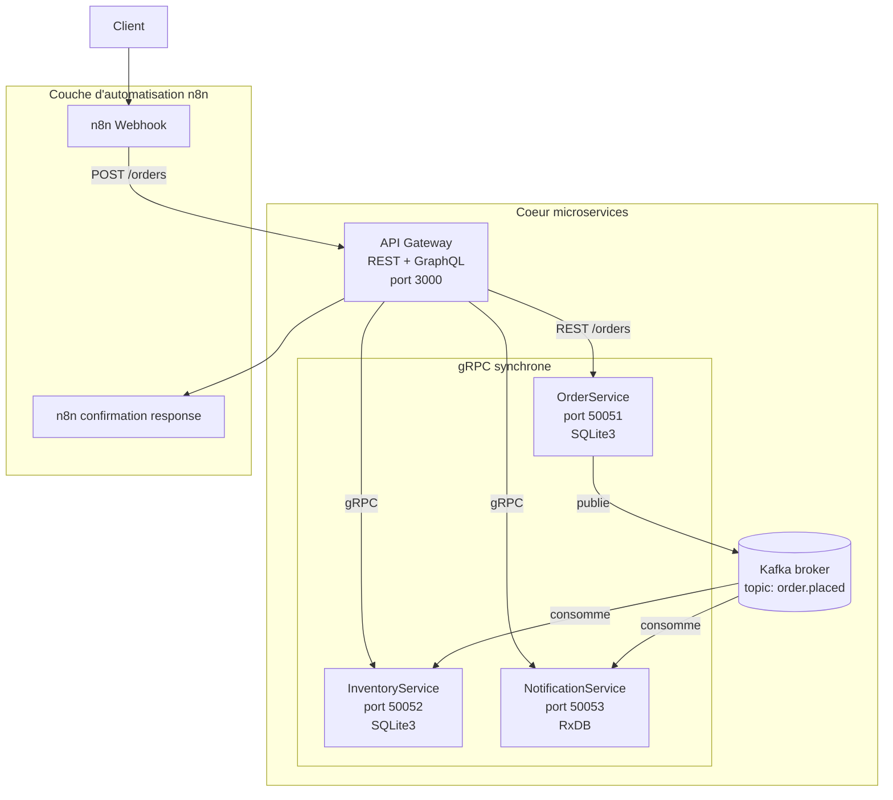

# Architecture du projet

## Vue globale

Client
  |
  | REST (HTTP/1.1 + JSON)
  | GraphQL (HTTP/1.1 + JSON)
  |
  v
API Gateway (port 3000)
  |
  | gRPC (HTTP/2 + Protobuf)
  |------------------------------|------------------------------|
  v                              v                              v
OrderService (50051)    InventoryService (50052)    NotificationService (50053)
  |                              |                              |
  v                              v                              v
SQLite3 (orders.db)     SQLite3 (inventory.db)          RxDB (NoSQL)
  |
  | Kafka - topic: order.placed
  |------------------------------|
  v                              v
InventoryService           NotificationService
(deduit le stock)          (cree une notification)

## Communication synchrone - gRPC

| Appelant    | Service cible       | Methodes                              |
|-------------|---------------------|---------------------------------------|
| API Gateway | OrderService        | CreateOrder, GetOrder, ListOrders     |
| API Gateway | InventoryService    | GetProduct, ListProducts, UpdateStock |
| API Gateway | NotificationService | SendNotification, ListNotifications   |

## Communication asynchrone - Kafka

| Topic        | Producteur   | Consommateurs                         |
|--------------|--------------|---------------------------------------|
| order.placed | OrderService | InventoryService, NotificationService |

Contenu du message order.placed :
{
  "order_id": "uuid",
  "product_id": "p1",
  "quantity": 2,
  "customer": "lotfi"
}

## Bases de donnees

| Service             | Type  | Technologie | Stockage     |
|---------------------|-------|-------------|--------------|
| OrderService        | SQL   | SQLite3     | orders.db    |
| InventoryService    | SQL   | SQLite3     | inventory.db |
| NotificationService | NoSQL | RxDB        | En memoire   |

## Ports utilises

| Service             | Port  | Protocole |
|---------------------|-------|-----------|
| API Gateway         | 3000  | HTTP      |
| OrderService        | 50051 | gRPC      |
| InventoryService    | 50052 | gRPC      |
| NotificationService | 50053 | gRPC      |
| Kafka Broker        | 9092  | TCP       |
| Zookeeper           | 2181  | TCP       |

## Architecture avec couche d'automatisation n8n

La couche n8n a été ajoutée pour automatiser l'orchestration du parcours de commande sans complexifier les microservices eux-mêmes. Elle apporte une intégration plus rapide des scénarios métiers, une meilleure souplesse pour faire évoluer le workflow de confirmation et une séparation nette entre la logique d'automatisation et la logique métier centrale.